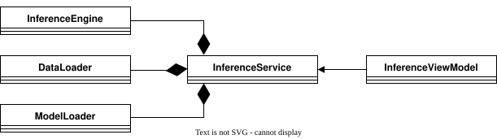

# LetUsInfer

A desktop AI inference studio built with **C++23**, **Qt 6 (QML)**, and **ONNX Runtime**. LetUsInfer lets you point at a directory of images, pick an ONNX model, and instantly see top-K classification results — all from a native desktop UI.

## v0.1 — What's Included

- **Batch image classification** using MobileNetV2 (ONNX) on a user-selected image directory
- **MVVM architecture** with clean separation: `InferenceService` owns backend components (`DataLoader`, `Preprocessor`, `ModelLoader`, `InferenceEngine`); `InferenceViewModel` bridges to QML via `Q_PROPERTY` and `Q_INVOKABLE`
- **Dependency injection** — both service and viewmodel are constructed in `main.cpp` and wired without QML-side instantiation
- **QML UI** with `FolderDialog`, `FileDialog`, `SpinBox` (top-K), drag-and-drop image preview, and a `TableView` displaying ranked results
- **Preprocessing pipeline**: resize → BGR-to-RGB → normalize (ImageNet mean/std) → HWC-to-CHW channel split → flatten
- **Error handling** via `std::expected` throughout the backend

## Architecture


`InferenceService` composes all backend components. `InferenceViewModel` holds a non-owning pointer to the service and exposes results to QML as a `QVariantList` of `QVariantMap`.

## Tech Stack

| Component       | Technology                          |
|-----------------|-------------------------------------|
| Language        | C++23                               |
| UI Framework    | Qt 6.10.1 (QML / QtQuick)          |
| ML Runtime      | ONNX Runtime 1.23.2                |
| Image Processing| OpenCV                              |
| Build System    | CMake + CMakePresets.json           |
| Package Manager | vcpkg (local, arm64-osx)            |
| Platform        | macOS arm64                         |

## Model

- **MobileNetV2** (`mobilenetv2_140_Opset18_timm`) from the ONNX Model Zoo
- **ImageNet 1K** class labels (1000 classes)
- Input: 224×224, RGB, normalized with mean `[0.485, 0.456, 0.406]` and std `[0.229, 0.224, 0.225]`

## Prerequisites

- Qt 6.10.1 installed (e.g. via Qt Online Installer)
- vcpkg with `onnxruntime` and `opencv4` installed for `arm64-osx`
- CMake ≥ 3.21

## Build

```bash
# Set VCPKG_ROOT to your local vcpkg directory
export VCPKG_ROOT=/path/to/vcpkg

# Release build (recommended — debug has a known ONNX schema assertion issue)
./build.sh --release

# Clean release build
./build.sh -c --release

# Run
./build/release/LetUsInfer
```

## Usage

1. Launch the app
2. Select an **image directory** containing `.JPEG` files
3. Select a **MobileNetV2 ONNX model** file
4. Adjust **Top-K** (1–10, default 5)
5. Click **Run Inference**
6. View ranked predictions with confidence scores in the results table

## Project Structure

```
LetUsInfer/
├── src/
│   ├── main.cpp
│   ├── model/          # DataLoader, Preprocessor, ModelLoader, InferenceEngine
│   ├── service/        # InferenceService (orchestrator)
│   └── viewmodel/      # InferenceViewModel (QML bridge)
├── include/
│   ├── common/types.h  # Shared types, enums, structs
│   ├── model/
│   ├── service/
│   └── viewmodel/
├── qml/
│   ├── Main.qml
│   ├── input/InputView.qml
│   └── output/OutputView.qml
├── assets/
│   ├── labels/imagenet_classes.txt
│   └── models/         # Place your ONNX model here
├── CMakeLists.txt
├── CMakePresets.json
├── build.sh
└── docs/
```

## Known Limitations (v0.1)

- Only `.JPEG` extension is recognized (case-sensitive)
- Single-image inference only (first image in directory is processed)
- Confidence scores are raw logits, not softmax probabilities
- Debug builds hit an ONNX schema registration assertion (vcpkg `onnx 1.19.0` vs `onnxruntime 1.23.2` conflict) — use Release builds
- Fixed-size UI layout; no responsive scaling

## License

[MIT](LICENSE)